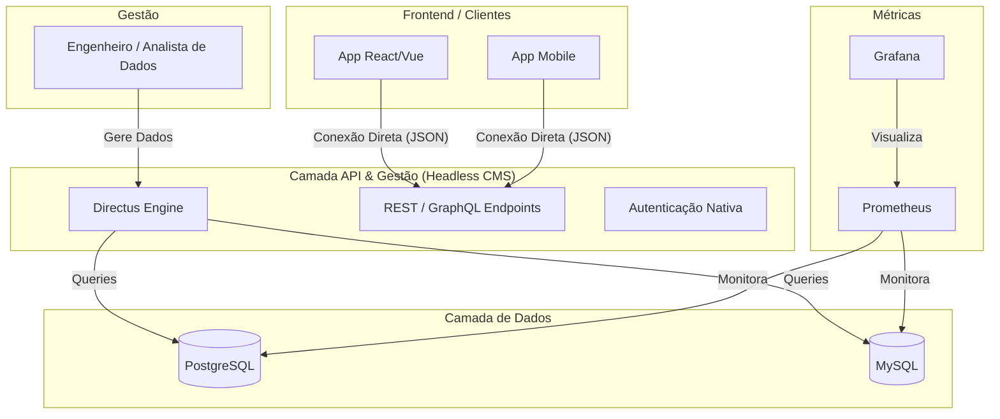

# 🚀 PolyDB Platform

> **Gerenciamento de dados unificado e observável através do Directus Headless CMS.**


---

## 📋 Visão Geral

A **PolyDB Platform** simplifica o acesso a múltiplos bancos de dados utilizando o **Directus** como camada unificada. Reduzimos a complexidade eliminando wrappers customizados (como FastAPI), permitindo uma conexão direta entre o backend inteligente do Directus e o frontend.

### ✨ Diferenciais
- **API Nativa Instantânea:** O Directus gera endpoints REST e GraphQL automaticamente para cada tabela.
- **Autenticação Integrada:** Gestão de usuários, papéis e permissões (RBAC) pronta para uso.
- **Zero Redundância:** Aproveita as funcionalidades nativas do Directus para CRUD, autenticação e gestão de arquivos.
- **Observabilidade:** Monitoramento da infraestrutura via stack Prometheus/Grafana.

### 👥 Fluxo Simplificado
O **Programador** consome dados diretamente dos endpoints do Directus via `fetch` ou SDK oficial, enquanto o **Especialista de Dados** gerencia as fontes de informação visualmente.

---

## 🏗️ Arquitetura do Sistema [1.1]




---

## 🚀 Como Iniciar (Ambiente Simplificado)

### 1. Preparar o Ambiente
```powershell
# Clonar o repositório e entrar na pasta
python -m venv venv
.\venv\Scripts\Activate.ps1
pip install -r requirements.txt
```

### 2. Subir Infraestrutura (Docker)
A infraestrutura agora é centrada no Directus, que gerencia os bancos e fornece a API.
```powershell
# Inicia containers de Postgres, MySQL, Prometheus, Grafana e Directus
docker compose -f docker/docker-compose.yml up -d
```

### 3. Popular Ecossistema de Dados
```powershell
# Gera dados nas tabelas para apresentação
python scripts/seed_presentation.py
```

### 4. Acesso ao Sistema
| Serviço | URL | Credenciais |
| :--- | :--- | :--- |
| **API & Admin (Directus)** | [http://localhost:8055](http://localhost:8055) | `admin@example.com` / `admin` |
| **Métricas (Prometheus)** | [http://localhost:9090](http://localhost:9090) | - |
| **Visualização (Grafana)** | [http://localhost:3000](http://localhost:3000) | `admin` / `admin` |

---

## 🛠️ Tecnologias Utilizadas

- **Admin Panel & API:** Directus (Headless CMS) para gestão visual de dados e endpoints automáticos.
- **Bancos de Dados:** PostgreSQL e MySQL.
- **Monitoramento:** Prometheus e Grafana para observabilidade da infraestrutura.
- **Infra:** Docker & Docker Compose para orquestração da stack.

---

## 📄 Documentação Detalhada

Links para documentos de apoio:
- [Arquitetura Simplificada](docs/architecture.md)
- [Plano de Simplificação](docs/simplification_plan.md)
- [Resumo de Handover](docs/handover.md)

---

## 📌 Autor

**Rilen T. L.**  
*Data Engineering & Platform Architecture*  
📍 Rio das Ostras — RJ
