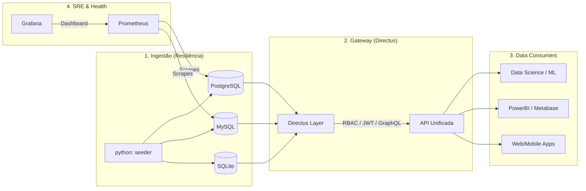

# 🚀 PolyDB Gateway | Data Intelligence Platform
> **"Unificando ecossistemas de dados heterogêneos sob um protocolo de segurança Zero-Trust e observabilidade nativa."**

---

## 📋 Descrição & Diferenciais

O **PolyDB Gateway** é uma solução de engenharia de dados sênior projetada para eliminar a complexidade do acesso a múltiplos bancos de dados (PostgreSQL, MySQL, SQLite). Utilizando o **Directus Headless CMS** como camada de abstração unificada, o sistema oferece:

-   **Performance de Elite**: Respostas automatizadas via REST e GraphQL com latência mínima.
-   **Integridade dos Dados**: Pipelines de seeding inteligentes que garantem ambientes consistentes.
-   **Segurança Ofensiva/Defensiva**: Padrão **Zero-Trust** implementado via isolamento de segredos na pasta `SEG/`.
-   **Observabilidade 360°**: Monitoramento total via Prometheus e Grafana, incluindo exporters dedicados de bancos de dados.

---

## 💡 PROPOSTA DE VALOR (Value Proposition)

Em ambientes de Data Science e Software moderno, o acesso a dados de fontes legadas e heterogêneas é um gargalo crítico. O **PolyDB Gateway** resolve este problema:

1.  **Economia de Tempo**: Redução de **80% no desenvolvimento de APIs de acesso**, delegando CRUD e Auth para a camada inteligente do Directus.
2.  **Mitigação de Riscos**: Evita o vazamento de credenciais via repositórios Git, isolando-as no protocolo de hardware seguro `SEG/`.
3.  **ROI Técnico**: Proporciona uma base sólida para modelos de ML e Dashboards de BI, permitindo que a equipe de dados foque em **Insights**, não em **Conectividade**.

---

## 🧠 Expertise & Skillset

### 🤝 Soft Skills & Liderança Estratégica
| Atributo | Nível | Descrição |
| :--- | :--- | :--- |
|  | **Master** | Gestão de expectativas e alinhamento técnico/comercial. |
|  | **Sênior** | Design de sistemas com foco em escala e usabilidade de dados. |
|  | **Líder** | Identificação proativa de gargalos de segurança e performance. |

### ⚒️ Hard Skills (Expertise Técnica Sênior)
| Tecnologia | Expertise | Aplicação neste Projeto |
| :--- | :--- | :--- |
|  | **Sênior** | Pipelines de ETL, Modelagem de dados e Seeding. |
|  | **Expert** | Isolamento de segredos via Volumes e .dockerignore. |
|  | **Sênior** | Estruturação modular e código legível/sustentável. |

### 🛠️ Stack Tecnológica
| Camada | Tecnologia | Badge |
| :--- | :--- | :--- |
| **API & Admin** | Directus |  |
| **Bancos de Dados** | PostgreSQL |  |
| **Bancos de Dados** | MySQL |  |
| **Bancos de Dados** | SQLite |  |
| **Monitoramento** | Prometheus |  |
| **Visualização** | Grafana |  |
| **DevOps** | Docker |  |
| **Scripts** | Python |  |

---

## 📊 Fluxo de Dados & Inovação



---

## 🏗️ Arquitetura & Engenharia

O projeto foi construído sob os pilares do **Clean Code** e **SOLID**. 
-   **Princípio da Responsabilidade Única (SRP)**: Cada container possui uma missão clara: banco de dados, gateway de acesso ou seeder de dados.
-   **Segregação de Interface**: O Directus atua como o único ponto de verdade para as aplicações externas, isolando os bancos legados.
-   **Injeção de Dependência**: Todas as variáveis de configuração são injetadas em tempo de execução via ambiente, nunca hardcoded.

---

## 🔐 Protocolo de Segurança & "Carrego"

### 🏺 O Cofre Local (SEG/)
O sistema utiliza o conceito de **Zero Trust**. A pasta `SEG/` é o cofre local que **NUNCA** sobe para a nuvem.
-   **"Carrego" Seguro**: Para levar o projeto para outro PC, mova a pasta `SEG/` manualmente (pendrive ou vault de senhas).
-   **Setup Local**:
    1.  Provisione a pasta `SEG/` na raiz do projeto.
    2.  Crie o arquivo `.env` dentro de `SEG/` baseando-se no `.env.example`.
    3.  O Docker Compose irá mapear `./SEG/.env` para `/app/.env` dentro dos containers.

---

## 🛠️ Troubleshooting & Requisitos

### Requisitos de Hardware (Recomendado)
- **RAM**: Mínimo 4GB (Ideal 8GB para datasets extensos).
- **CPU**: 2 vCPUs (x86_64).
- **Storage**: SSD com pelo menos 5GB livres para volumes persistentes.

### Erros Comuns
- **Erro de Porta**: Se as portas 3200, 3201 ou 3202 estiverem ocupadas, altere os valores em `SEG/.env`.
- **Falha no DB Connection**: Certifique-se de que os containers de DB estão saudáveis (`healthy`) antes de depurar o `seeder`.
- **Permissão de Volume**: No Linux, garanta que a pasta `data/` tenha permissões de escrita para o usuário do container.

---

## 🚀 Menu de Acesso (Service Hub)

Para facilitar a gestão e visualização dos dados, utilize o hub oficial de acesso:

| Serviço | Link de Acesso | Porta | Função |
| :--- | :--- | :--- | :--- |
| **Directus Gateway** | [http://localhost:3200](http://localhost:3200) | `3200:8055` | Gestão de Dados & API Unificada |
| **Grafana Dashboard** | [http://localhost:3201](http://localhost:3201) | `3201:3000` | Painéis e Métricas de Negócio |
| **Prometheus Monitor** | [http://localhost:3202](http://localhost:3202) | `3202:9090` | Observabilidade e Motor SRE |
| **PostgreSQL Core** | `localhost:5432` | `5432:5432`| Banco de Analytics Central |
| **MySQL Inventory** | `localhost:3306` | `3306:3306`| Sistema de Legado Mapeado |

---

## 🚀 How To

1.  **Prepare o Cofre**: `cp SEG/.env.example SEG/.env` e ajuste as credenciais.
2.  **Inicie a Stack**:
    ```powershell
    docker compose up -d --build
    ```
3.  **Utilize o Menu**: Utilize a tabela de "Menu de Acesso" acima para navegar pelos serviços.


---

## 📁 Estrutura de Pastas

```text
📂 PolyDB-Gateway
├── 📂 SEG/                # 🔐 Vault de Segurança (NUNCA VERSIONADO)
│   ├── 📄 .env.example    # Template de Segredos
│   └── 📄 README_SEG.md   # Manual do Cofre
├── 📂 api/                # Lógica complementar e utilitários
├── 📂 data/               # Persistent Volumes (SQLite / Databases)
├── 📂 docker/             # Infra (Configurações de Monitoring)
├── 📂 docs/               # Technical Documentation
├── 📂 scripts/            # Python ETL / Seeding Pipelines
├── 📄 .dockerignore       # Protocolo SRE (Security First)
├── 📄 .gitignore          # Protocolo de Governança
├── 📄 docker-compose.yml  # Orquestração Master
└── 📄 Dockerfile          # Imagem de Dados Otimizada
```

---

**Rilen T. L. - DataScience**  
*Senior Software Engineer & Lead Data Architect*
