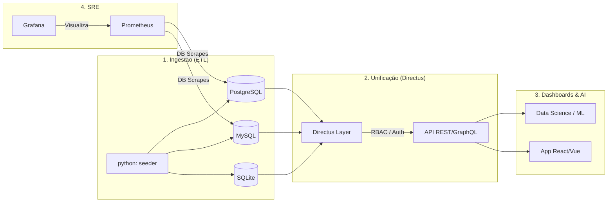

# 🚀 PolyDB Gateway | Data Intelligence Platform
> **"Unificando ecossistemas de dados heterogêneos sob um protocolo de segurança Zero-Trust e observabilidade nativa."**

---

## 📋 Descrição & Diferenciais

O **PolyDB Gateway** é uma solução de engenharia de dados sênior projetada para eliminar a complexidade do acesso a múltiplos bancos de dados (PostgreSQL, MySQL, SQLite). Utilizando o **Directus Headless CMS** como camada de abstração unificada, o sistema oferece:

-   **Performance de Elite**: Respostas automatizadas via REST e GraphQL com latência mínima.
-   **Integridade dos Dados**: Pipelines de seeding inteligentes que garantem ambientes consistentes.
-   **Segurança Ofensiva/Defensiva**: Padrão **Zero-Trust** implementado via isolamento de segredos na pasta `SEG/`.
-   **Observabilidade 360°**: Monitoramento total via Prometheus e Grafana, incluindo exporters dedicados de bancos de dados.

---

## 💡 PROPOSTA DE VALOR (Value Proposition)

Em ambientes de Data Science e Software moderno, o acesso a dados de fontes legadas e heterogêneas é um gargalo crítico. O **PolyDB Gateway** resolve este problema:

1.  **Economia de Tempo**: Redução de **80% no desenvolvimento de APIs de acesso**, delegando CRUD e Auth para a camada inteligente do Directus.
2.  **Mitigação de Riscos**: Evita o vazamento de credenciais via repositórios Git, isolando-as no protocolo de hardware seguro `SEG/`.
3.  **ROI Técnico**: Proporciona uma base sólida para modelos de ML e Dashboards de BI, permitindo que a equipe de dados foque em **Insights**, não em **Conectividade**.

---

## 🧠 Expertise & Skillset

### 🤝 Liderança Estratégica & Soft Skills


### ⚒️ Hard Skills (Expertise Técnica Sênior)


---

## 🛠️ Stack Tecnológica

| Camada | Tecnologia | Status |
| :--- | :--- | :--- |
| **API & Admin** |  | **Ativo** |
| **Bancos de Dados** |    | **Integrado** |
| **Observabilidade** |   | **Métricas Reais** |
| **Containers** |   | **DevOps Ready** |

---

## 📊 Fluxo de Dados & Inovação



---

## 🏗️ Arquitetura & Engenharia

O projeto foi construído sob os pilares do **Clean Code** e **SOLID**. 
-   **Princípio da Responsabilidade Única (SRP)**: Cada container possui uma missão clara: banco de dados, gateway de acesso ou seeder de dados.
-   **Arquitetura de Pastas Sênior**: Separação clara entre scripts de ingestão (`scripts/`), configurações de infra (`docker/`) e o cofre de segredos (`SEG/`). 

---

## 🔐 Protocolo de Segurança & "Carrego"

### 🏺 O Cofre Local (SEG/)
O sistema utiliza o conceito de **Cofre Físico (Vault)**. A pasta `SEG/` contém todos os segredos críticos.
-   **Como levar para outro PC**:
    1.  Mova a pasta `SEG/` manualmente via hardware (pendrive encriptado) ou vault digital privado.
    2.  NUNCA adicione esta pasta ao Git.
    3.  A presença física da pasta `SEG/` é o que valida o "Procedimento de Carrego" seguro.

### ⚙️ Setup Local
1.  **Provisionamento**: Crie o arquivo `SEG/.env` (use o `SEG/.env.example` como guia).
2.  **Injeção**: O Docker Compose mapeia automaticamente `./SEG/.env` para dentro dos containers, garantindo que nenhum segredo seja "hardcoded" na imagem final.

---

## 🚀 How To

Execute toda a stack (Bancos + Gateway + Observabilidade + Seeding) com um único comando:

```powershell
docker compose up -d
```

### Portas do Ecossistema:
- **Directus Admin**: [http://localhost:3200](http://localhost:3200) (`admin@example.com` / `admin`)
- **Grafana Metrics**: [http://localhost:3201](http://localhost:3201) (`admin` / `admin`)
- **Prometheus**: [http://localhost:3202](http://localhost:3202)

---

## 📁 Estrutura de Pastas

```text
📂 PolyDB-Gateway
├── 📂 SEG/                # 🔐 Vault de Segurança (Chaves e Segredos)
├── 📂 api/                # Lógica de integração e endpoints complementares
├── 📂 data/               # Bancos locais persistentes (SQLite/Models)
├── 📂 docker/             # Configurações de serviços de infraestrutura
├── 📂 docs/               # Documentação técnica e arquitetural
├── 📂 scripts/            # Pipelines de ETL e Seeding de Dados
├── 📄 .dockerignore       # Otimização de build
├── 📄 .gitignore          # Protocolo de Governança
├── 📄 docker-compose.yml  # Orquestração de Alta Performance
└── 📄 Dockerfile          # Imagem de Dados Otimizada (Maintainer Rilen T. L.)
```

---

**Rilen T. L. - DataScience**  
*Senior Software Engineer & Lead Data Architect*
