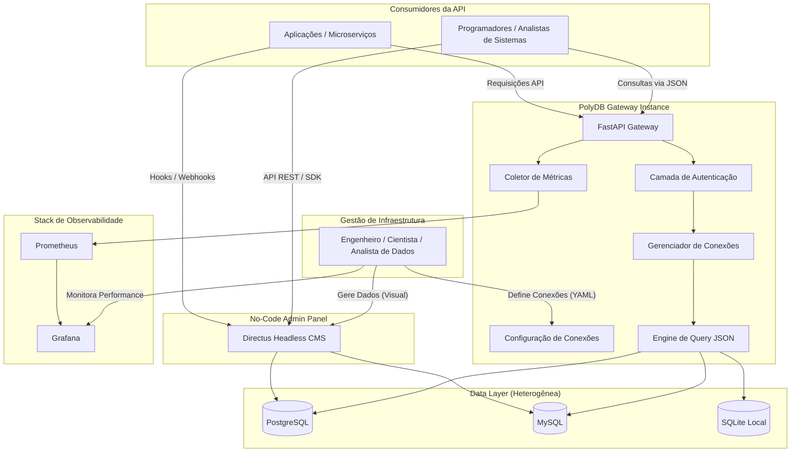

# 🚀 PolyDB Gateway

> **Camada de abstração e gateway unificado para acesso a múltiplos bancos de dados com observabilidade nativa.**


---

## 📋 Visão Geral

O **PolyDB Gateway** transforma bancos de dados complexos em componentes **"Plug and Play"**. Através de uma camada de abstração, ele permite que programadores consumam dados sem se preocupar com a infraestrutura, credenciais ou drivers específicos.

Isso é o que chamamos de **"Data-as-a-Service"** (Dados como Serviço) 🚀.

### ✨ Diferenciais
- **Acesso Unificado:** Uma única API para consultar PostgreSQL, MySQL e SQLite.
- **Observabilidade:** Coleta distribuída de latência de query, erros e conexões ativas via Prometheus/Grafana.
- **Interface Padronizada:** Respostas JSON consistentes, facilitando o consumo por diversas tecnologias.
- **Desacoplamento:** Separação clara entre a Camada de Dados, o Gateway (API) e os Consumidores (Apps).

### 👥 Consumidores Suportados
O Gateway foi projetado para ser agnóstico, permitindo o consumo por:
- **Web (HTML5/JS):** Dashboards interativos via `fetch` API.
- **Backend Legado (PHP):** Integração simples via `cURL`.
- **Scripts de Ciência de Dados (Python):** Automações robustas com a biblioteca `requests`.
- **Aplicações Mobile:** Consumo via requisições HTTP padrão.

---

## 🔄 Rotina e Papel do Especialista de Dados

Neste projeto, o **Cientista/Engenheiro de Dados** atua como o arquiteto da informação. O seu trabalho rotineiro utilizando o PolyDB Gateway envolve:

1.  **Governança de Dados:** Definir no arquivo `databases.yaml` quais fontes de dados a empresa pode acessar com segurança.
2.  **Monitoramento de Performance:** Usar o **Grafana** para identificar queries lentas (gargalos) que podem estar afetando a produção.
3.  **Sanitização de Consultas:** Garantir que o Gateway esteja entregando JSONs limpos para que o **Programador** não precise tratar tipos de dados complexos de bancos antigos.
4.  **Escalabilidade:** Configurar novos clusters e conectá-los ao Gateway sem que a aplicação final precise mudar uma única linha de código.

---

## 🏗️ Arquitetura do Sistema



---

## 🚀 Como Iniciar (Demonstração Local)

### 1. Preparar o Ambiente
```powershell
# Clonar o repositório e entrar na pasta
python -m venv venv
.\venv\Scripts\Activate.ps1
pip install -r requirements.txt
```

### 2. Subir Infraestrutura (Docker)
```powershell
# Inicia containers de Postgres, MySQL, Prometheus e Grafana
docker compose -f docker/docker-compose.yml up -d
```

### 3. Popular Ecossistema de Dados
```powershell
# Gera dados ricos em todos os bancos para apresentação
python scripts/seed_presentation.py
```

### 4. Executar o Gateway
```powershell
python api/gateway.py
```

### 5. Dashboards & API
- **API Docs (Swagger):** [http://localhost:8000/docs](http://localhost:8000/docs)
- **Headless CMS (Directus):** [http://localhost:8055](http://localhost:8055) (Login: admin@example.com / admin)
- **Métricas Brutas (Prometheus):** [http://localhost:9090](http://localhost:9090)
- **Visualização (Grafana):** [http://localhost:3000](http://localhost:3000) (Login: admin/admin)

---

## 🛠️ Tecnologias Utilizadas

- **Backend:** Python 3.13+ com FastAPI.
- **Admin Panel:** Directus (Headless CMS) para gestão visual de dados.
- **Configuração:** YAML para gestão dinâmica de inventário de bancos.
- **Monitoramento:** Prometheus Client para exportação de métricas.
- **Infra:** Docker & Docker Compose para stack de bancos e monitoramento.

---

## 📄 Documentação Detalhada

Links para documentos de apoio e blueprint:
- [Arquitetura Completa](docs/architecture.md)
- [Fluxo de Requisição](docs/request-flow.md)
- [Resumo de Handover](docs/handover.md)

---

## 📌 Autor

**Rilen T. L.**  
*Data Engineering & API Architecture*  
📍 Rio das Ostras — RJ
