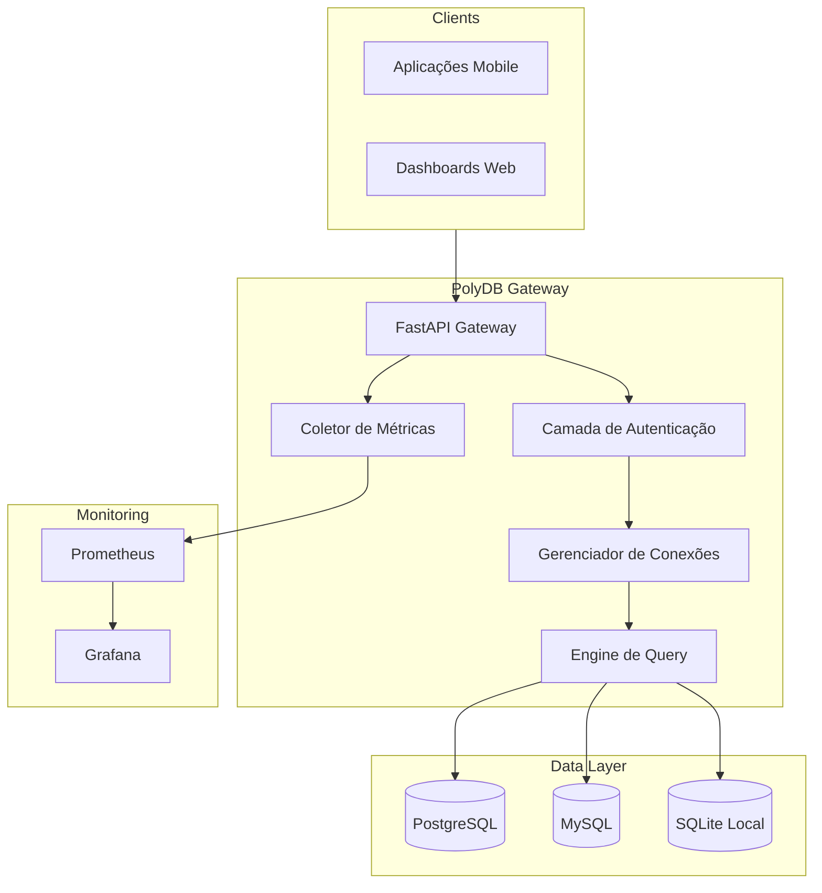

# 🚀 PolyDB Gateway

> **Camada de abstração e gateway unificado para acesso a múltiplos bancos de dados com observabilidade nativa.**


---

## 📋 Visão Geral

O **PolyDB Gateway** é uma solução de infraestrutura leve desenvolvida para simplificar a interação entre aplicações e diversos ecossistemas de bancos de dados relacionais. Ele centraliza a gestão de conexões, padroniza as respostas em JSON e fornece uma camada de métricas pronta para monitoramento (Prometheus/Grafana).

### ✨ Diferenciais
- **Acesso Unificado:** Uma única API para consultar PostgreSQL, MySQL e SQLite.
- **Observabilidade:** Coleta distribuída de latência de query, erros e conexões ativas.
- **Interface Padronizada:** Respostas JSON consistentes, independente do dialeto SQL do banco de dados.
- **Pronto para Cloud:** Estrutura conteinerizada ideal para deploys em Cloud Run ou Kubernetes.

---

## 🏗️ Arquitetura do Sistema



---

## 🚀 Como Iniciar (Demonstração Local)

### 1. Preparar o Ambiente
```powershell
# Clonar o repositório e entrar na pasta
python -m venv venv
.\venv\Scripts\Activate.ps1
pip install -r requirements.txt
```

### 2. Semear Banco de Dados Local (Demo)
```powershell
python scripts/seed_db.py
```

### 3. Executar o Gateway
```powershell
python api/gateway.py
```

### 4. Consultar a API
Acesse a documentação interativa em: [http://localhost:8000/docs](http://localhost:8000/docs)

---

## 🛠️ Tecnologias Utilizadas

- **Backend:** Python 3.13+ com FastAPI.
- **Configuração:** YAML para gestão dinâmica de inventário de bancos.
- **Monitoramento:** Prometheus Client para exportação de métricas.
- **Infra:** Docker & Docker Compose para stack de bancos e monitoramento.

---

## 📄 Documentação Detalhada

Links para documentos de apoio e blueprint:
- [Arquitetura Completa](docs/architecture.md)
- [Fluxo de Requisição](docs/request-flow.md)
- [Resumo de Handover](docs/handover.md)

---

## 📌 Autor

**Rilen T. L.**  
*Data Engineering & API Architecture*  
📍 Rio das Ostras — RJ
