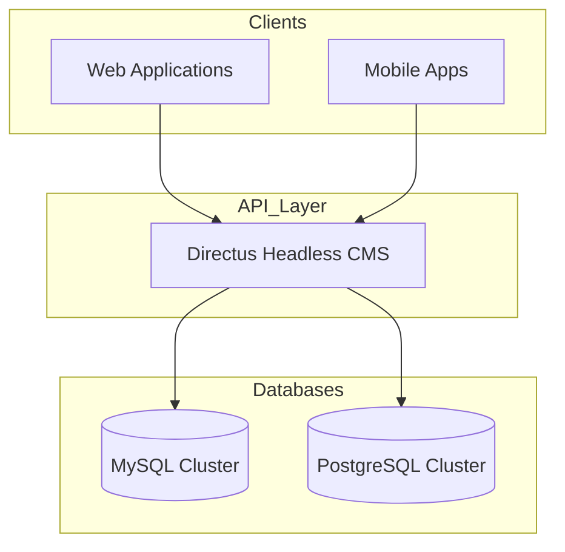

## Simplified Deployment Architecture (v1.1)

```mermaid
flowchart TB

subgraph Clients
A[Web Applications]
B[Mobile Apps]
end

subgraph API_Layer
C[Directus Headless CMS]
end

subgraph Databases
D[(MySQL Cluster)]
E[(PostgreSQL Cluster)]
end

A --> C
B --> C

C --> D
C --> E
```
