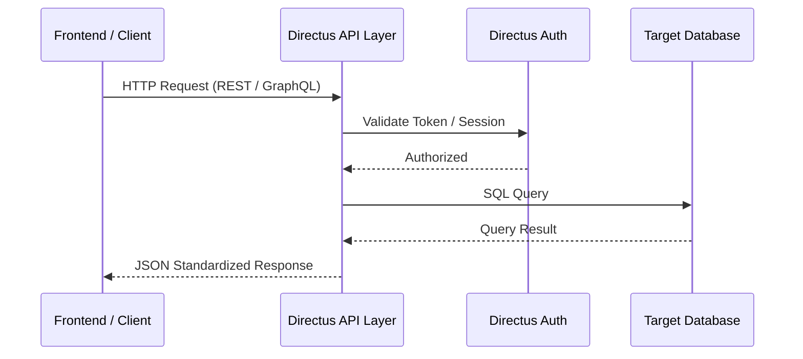

```mermaid
sequenceDiagram
    participant Client as Frontend / Client
    participant API as Directus API Layer
    participant Auth as Directus Auth
    participant DB as Target Database

    Client->>API: HTTP Request (REST / GraphQL)
    
    API->>Auth: Validate Token / Session
    Auth-->>API: Authorized
    
    API->>DB: SQL Query
    DB-->>API: Query Result
    
    API-->>Client: JSON Standardized Response
```
